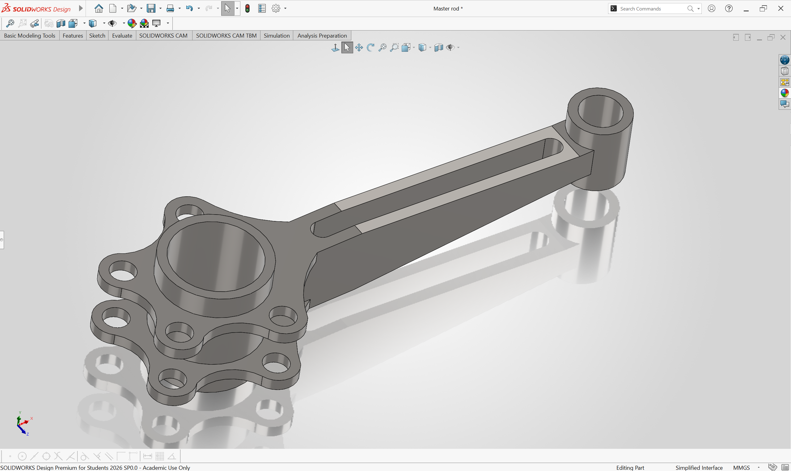
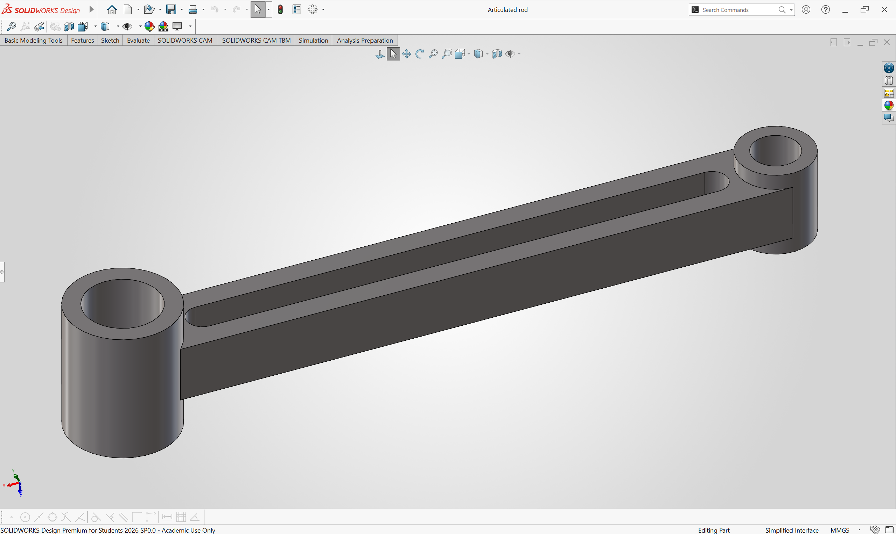
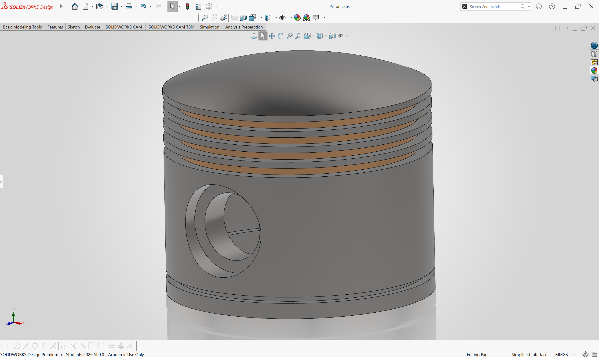

# ⚙️ Radial Engine CAD Assembly
**Software:** SolidWorks  
**Timeline:** December 2025 – February 2026  

Modeled a 5-cylinder radial engine to study mechanical timing of the 
main and articulated rod system. Ran motion studies to verify kinematics 
and clearances, performed FEA stress analysis, and generated a structured BOM.

### Key Components Modeled
- **Main Rod** — primary connecting rod linking the crankshaft to the master piston

- **Articulated Rod** — secondary rods connecting the remaining 4 pistons to the main rod

- **Piston Cap** — top closure of each piston assembly, designed for precise fitment and clearance tolerances

---
